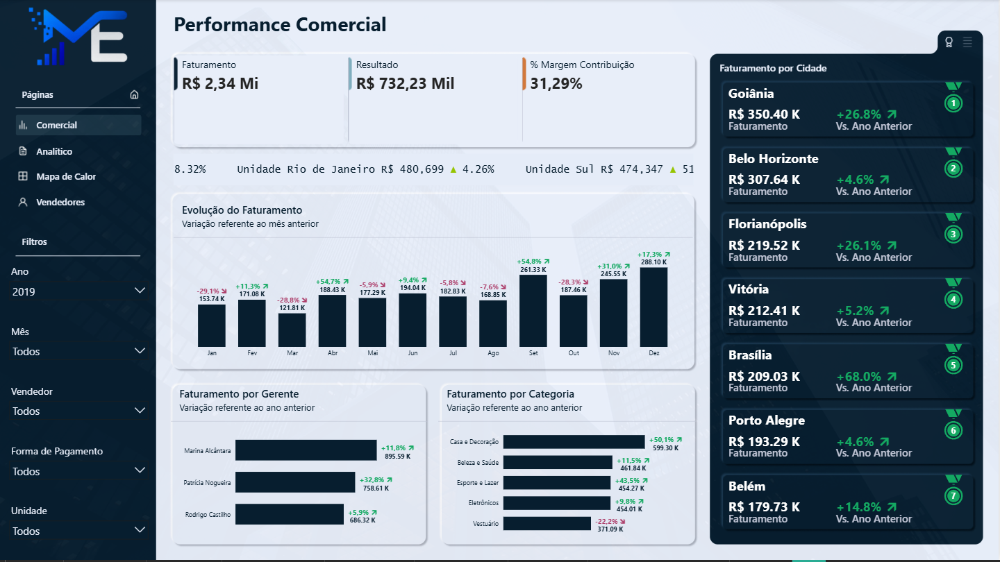
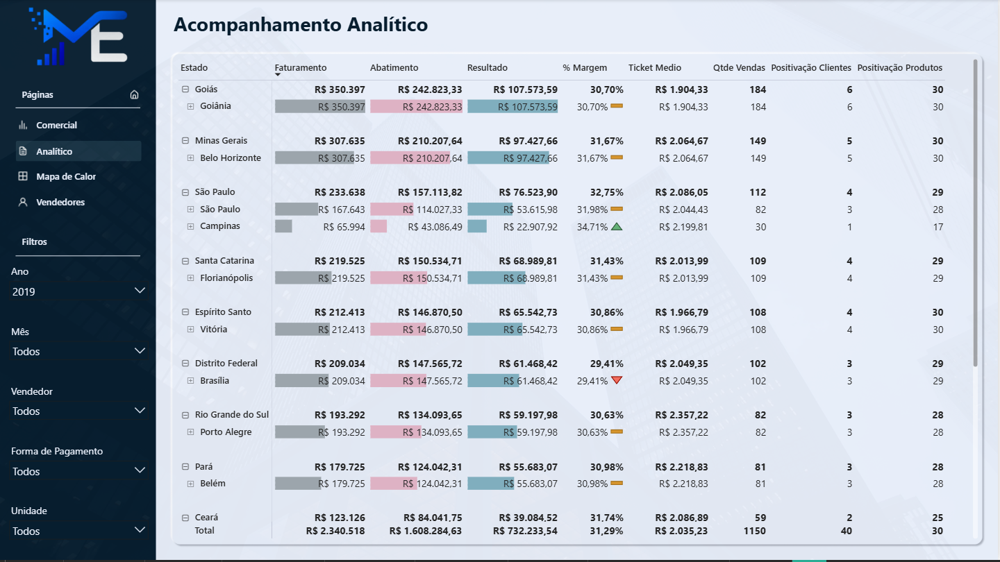
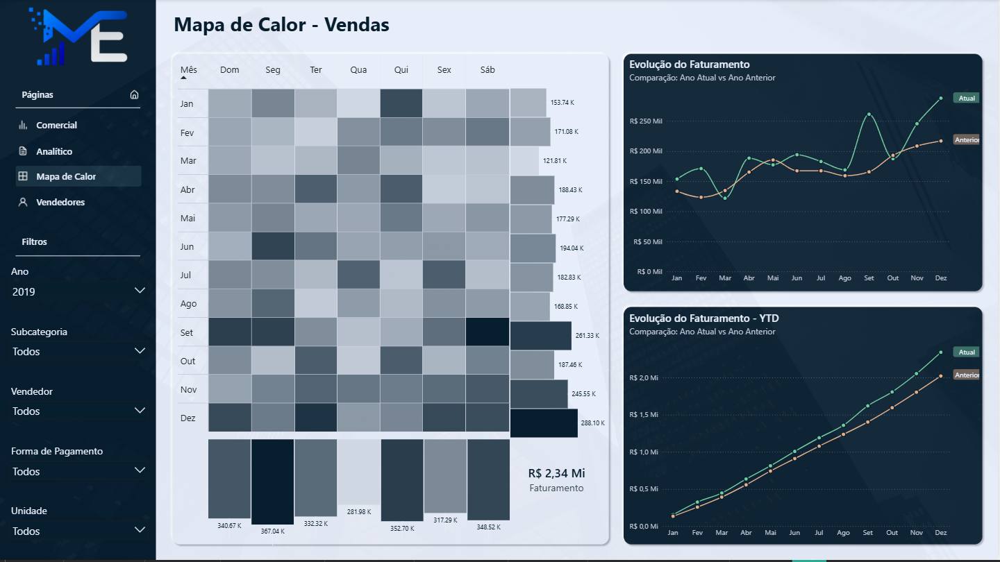
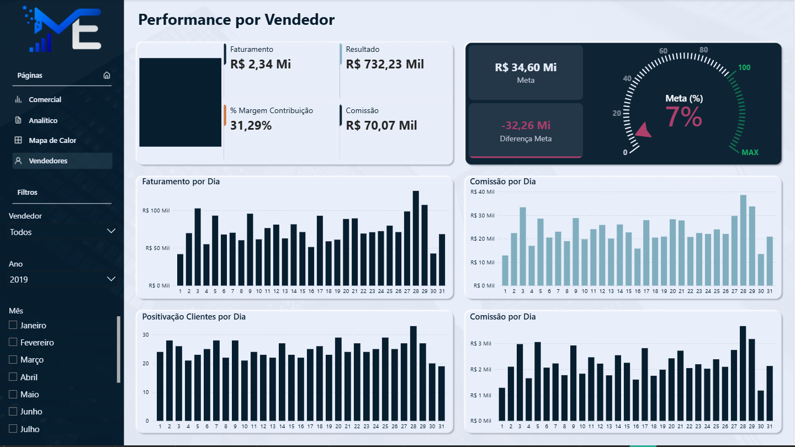

# 📊 Dashboard de Performance Comercial

Dashboard em Power BI que transforma dados de vendas em respostas rápidas: **quanto vendemos, quanto lucramos, quem está batendo a meta e onde crescer.**

**[▶️ Assistir ao vídeo de demonstração](docs/dashboard-demo.mp4)**

## O que o dashboard mostra

- **Comercial:** faturamento, resultado e margem, com variação em relação ao ano e ao mês anteriores, e ranking das cidades
- **Analítico:** tabela por estado e cidade, com ticket médio, margem e positivação de clientes e produtos
- **Mapa de Calor:** em quais meses e dias da semana a empresa mais vende, e o acumulado do ano comparado com o ano anterior
- **Vendedores:** meta x realizado com velocímetro, comissão e desempenho dia a dia

📸 Ver prints das páginas

## Destaques técnicos

- **Modelagem em estrela**, com fatos de vendas e metas e 7 dimensões
- **Mais de 50 medidas DAX**, com inteligência de tempo (acumulado do ano, ano anterior e mês anterior)
- **Função DAX personalizada** que gera ícones SVG dinâmicos para mostrar se o indicador subiu ou caiu
- **Experiência de aplicativo**, com navegação por botões, bookmarks e tooltips personalizados
- **Versionado com Git** no formato PBIP/TMDL, então cada medida e cada visual pode ser lido aqui no repositório

**Ferramentas:** Power BI · DAX · Power Query · PBIP/TMDL · Git

> Dados fictícios, criados para estudo e portfólio.
